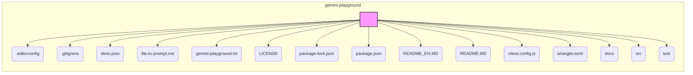
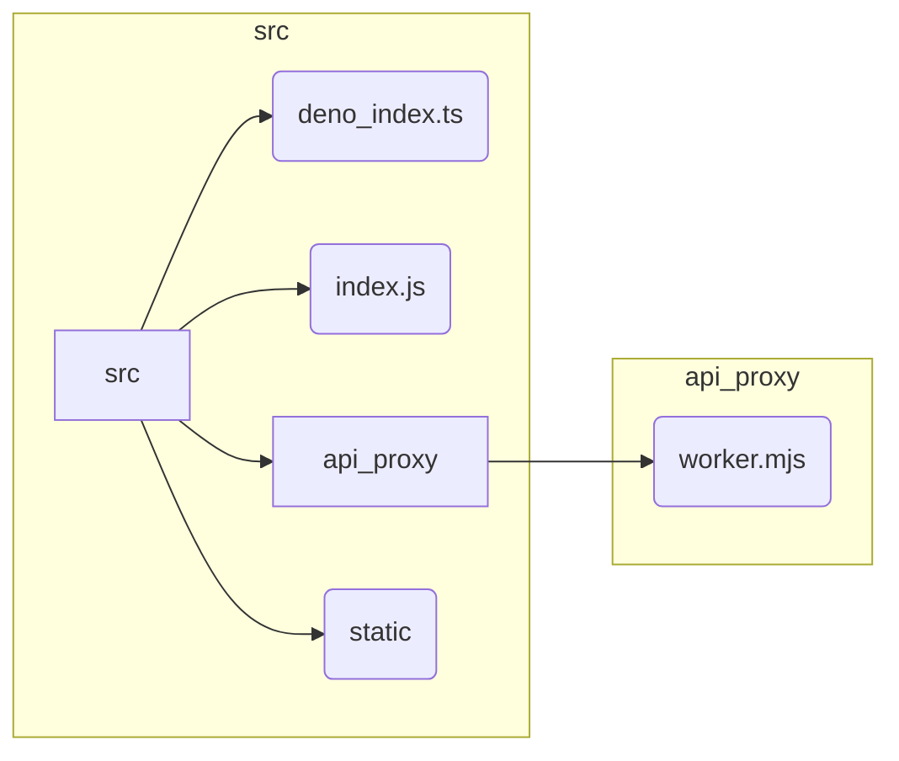
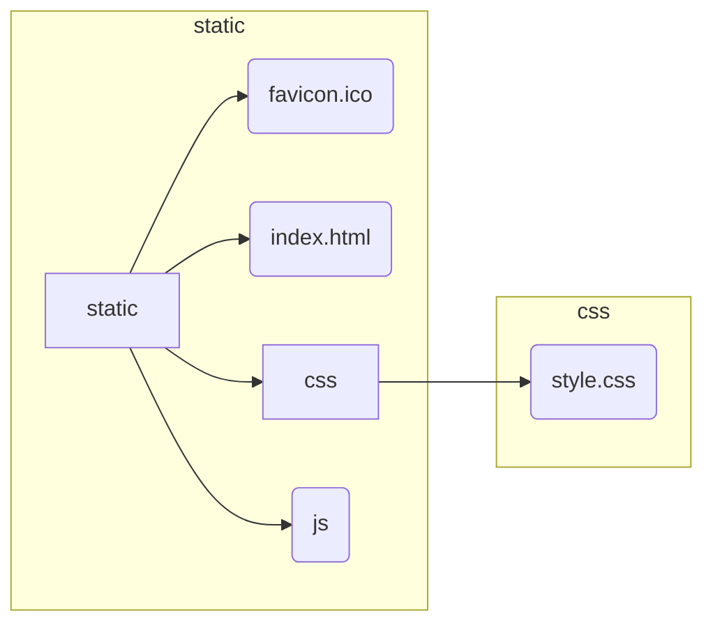
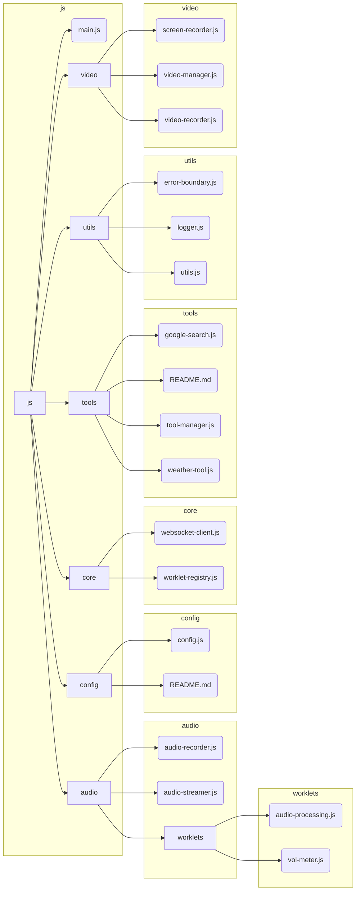
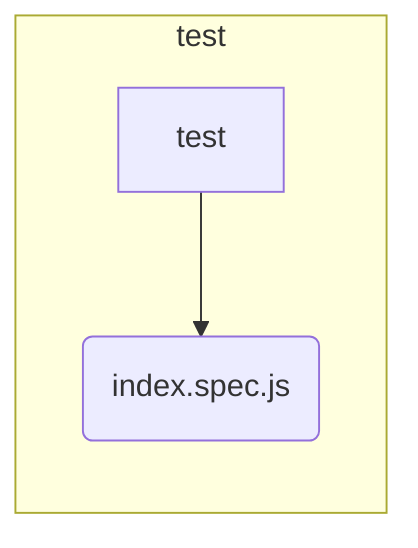

# Gemini Playground 项目报告

## 项目概述

`gemini-playground` 项目是一个 Web 应用程序，旨在提供一个交互式的界面，用于演示和测试 Google Gemini API 的功能。该项目利用现代 Web 技术栈，包括 Cloudflare Workers、WebSockets、WebRTC 以及 Deno 和 npm 等工具，构建了一个实时的、多模态的交互体验。用户可以通过文本、音频和视频与 Gemini 模型进行交互，并可以利用自定义工具扩展模型的功能。

该项目使用了 `files-to-prompt` 工具来尝试生成项目文件概览。然而，由于 `UnicodeDecodeError` 错误，许多二进制文件（如图片）和非 UTF-8 编码的文件被跳过。这意味着 `files-to-prompt` 生成的 `gemini-playground.txt` 文件并不完整，只包含了一部分文本文件的内容。

## 关键技术

*   **Deno:** `deno.json` 文件表明该项目使用 Deno 作为 JavaScript/TypeScript 运行时环境。Deno 提供了现代化的特性，如原生 TypeScript 支持、安全的沙箱执行环境以及去中心化的模块管理。
*   **npm:** `package-lock.json` 和 `package.json` 文件表明该项目使用 npm (Node Package Manager) 进行依赖包管理。虽然项目主要使用 Deno，但仍然可以使用 npm 来管理一些前端依赖。
*   **Vitest:** `vitest.config.js` 文件表明 Vitest 被用作测试框架。Vitest 是一个由 Vite 驱动的快速单元测试框架，与 Vite 的配置和插件生态系统紧密集成。
*   **Cloudflare Workers:** `wrangler.toml` 文件是 Cloudflare Workers 的配置文件。Cloudflare Workers 允许开发者在 Cloudflare 的全球边缘网络上部署无服务器函数，提供低延迟、高可扩展性和安全性。
*   **WebSockets:** `src/static/js/core/websocket-client.js` 文件表明项目使用 WebSockets 与 Gemini API 进行实时双向通信。WebSockets 允许服务器和客户端之间建立持久连接，实现低延迟的数据传输。
*   **WebRTC:** `src/static/js/audio` 和 `src/static/js/video` 目录下的文件表明项目使用了 WebRTC (Web Real-Time Communication) 技术来实现实时音频和视频流。WebRTC 允许浏览器之间直接进行点对点通信，无需插件或服务器中转。

## 项目结构 (Mermaid 图):

### 1. 顶层结构



*   `.editorconfig`:  定义代码编辑器的配置，例如缩进风格、字符集等，以保持代码风格的一致性。
*   `.gitignore`: 指定 Git 忽略的文件和目录，避免将不必要的文件提交到版本控制系统。
*   `deno.json`: Deno 的配置文件，定义了项目的 Deno 相关设置，例如任务 (tasks) 和导入映射 (import maps)。
*   `file-to-prompt.md`:  `files-to-prompt` 工具的使用指南。
*   `gemini-playground.txt`:  `files-to-prompt` 工具生成的项目文件内容输出（不完整）。
*   `LICENSE`: 项目的许可证文件。
*   `package-lock.json`: npm 自动生成的锁定文件，记录了项目依赖的确切版本，确保不同环境下的依赖一致性。
*   `package.json`: npm 项目的描述文件，包含了项目名称、版本、脚本、依赖等信息。
*   `README_EN.MD`: 项目的英文说明文档。
*   `README.MD`: 项目的中文说明文档。
*   `vitest.config.js`: Vitest 测试框架的配置文件。
*   `wrangler.toml`: Cloudflare Workers 的配置文件，定义了部署、环境变量、绑定等设置。
*   `docs`: 存放项目文档的目录。
*   `src`: 存放项目源代码的目录。
*   `test`: 存放项目测试代码的目录。

### 2. src 目录



*   `deno_index.ts`:  Deno 项目的入口文件（推测）。
*   `index.js`: 项目的入口文件（推测，可能是 Cloudflare Worker 的入口）。
*   `api_proxy`: 存放 API 代理相关代码的目录。
*   `api_proxy/worker.mjs`:  处理客户端和 Google Gemini API 之间请求代理的核心逻辑。
*   `static`: 存放静态资源（HTML、CSS、JavaScript、图像等）的目录。

### 3. static 目录



*   `favicon.ico`: 网站的图标文件。
*   `index.html`: 客户端应用程序的主 HTML 文件。
*   `css`: 存放 CSS 样式文件的目录。
*   `css/style.css`:  客户端应用程序的主要 CSS 样式文件。
*   `js`: 存放 JavaScript 代码的目录。

### 4. js 目录



*   `main.js`: 客户端应用程序的主要 JavaScript 逻辑入口。
*   `audio`: 存放音频处理相关代码的目录。
    *   `audio-recorder.js`: 实现音频录制功能，使用 Web Audio API 和 AudioWorklet 进行实时音频处理。
    *   `audio-streamer.js`: 管理音频数据的播放，支持排队、调度和应用音频效果（通过 worklet）。
    *   `worklets`: 存放 Web Audio API 的 AudioWorklet 脚本的目录。
        *   `audio-processing.js`:  AudioWorklet 脚本，将 Float32 音频数据转换为 Int16 格式，并分块发送。
        *   `vol-meter.js`:  AudioWorklet 脚本，计算音频流的音量级别 (RMS)。
*   `config`: 存放项目配置文件的目录。
    *   `config.js`: 定义项目的配置常量，如 API 版本、模型名称、系统指令、音频采样率等。
    *   `README.md`:  `config` 目录的说明文档。
*   `core`: 存放核心功能的目录。
    *   `websocket-client.js`:  实现 WebSocket 客户端，负责与 Gemini API 服务器建立连接、发送和接收消息，处理不同类型的响应（工具调用、设置完成、服务器内容等）。
    *   `worklet-registry.js`:  管理 Web Audio API worklet 的注册，允许从源代码创建 worklet URL。
*   `tools`: 存放工具类的目录，这些工具类扩展了 Gemini API 的功能。
    *   `google-search.js`:  Google 搜索工具的占位符（实际搜索功能由 Gemini API 服务器端处理）。
    *   `README.md`:  `tools` 目录的说明文档，解释如何添加自定义工具。
    *   `tool-manager.js`:  管理工具的注册和执行，处理来自 Gemini API 的工具调用请求。
    *   `weather-tool.js`:  一个模拟的天气工具，根据位置和日期返回模拟的天气预报。
*   `utils`: 存放实用工具函数的目录。
    *   `error-boundary.js`:  定义错误边界，提供预定义的错误代码和 `ApplicationError` 类，用于统一的错误处理。
    *   `logger.js`:  一个简单的日志记录器，将消息记录到控制台并触发事件，同时在内存中存储有限数量的日志。
    *   `utils.js`:  提供实用工具函数，例如将 Blob 转换为 JSON 对象，将 base64 字符串转换为 ArrayBuffer。
*   `video`: 存放视频处理相关代码的目录。
    *   `screen-recorder.js`:  实现屏幕录制功能，支持预览屏幕捕获并将帧发送到回调函数。
    *   `video-manager.js`: (推测) 管理视频流。
    *   `video-recorder.js`: (推测) 录制视频。

### 5. Test 目录

*  `index.spec.js`: 使用 Vitest 编写的测试文件

## 关键文件及其作用

*   **`src/api_proxy/worker.mjs`:** 此文件是项目的核心部分，处理客户端应用程序和 Google Gemini API 之间的所有通信。它实现了以下功能：
    *   **请求代理:** 将来自客户端的请求转发到 Gemini API。
    *   **身份验证:** 处理 API 密钥验证。
    *   **请求转换:** 将客户端请求转换为 Gemini API 所需的格式。
    *   **响应处理:** 解析 Gemini API 的响应，并将其转换为客户端可以理解的格式。
    *   **流式支持:** 支持通过 Server-Sent Events (SSE) 进行流式响应，实现实时交互。
    *   **工具调用:** 处理来自 Gemini API 的工具调用请求，并调用相应的工具函数。
    *   **错误处理:** 捕获和处理来自 API 或内部逻辑的错误。

*   **`src/static/index.html`:** 客户端应用程序的主 HTML 文件，定义了用户界面的基本结构。它包括：
    *   API 密钥输入框。
    *   配置选项（声音、响应类型、视频 FPS、系统指令）。
    *   连接/断开按钮。
    *   日志显示区域。
    *   消息输入框。
    *   发送、麦克风、摄像头、屏幕共享按钮。
    *   音频可视化器。
    *   视频预览窗口。

*   **`src/static/js/main.js`:** 客户端应用程序的主要 JavaScript 文件，实现了以下功能：
    *   处理用户界面事件（按钮点击、输入框输入等）。
    *   创建和管理 `MultimodalLiveClient` 实例，与后端进行通信。
    *   处理音频和视频流的录制、播放和显示。
    *   调用工具函数。
    *   更新用户界面（显示日志、切换按钮状态等）。

*   **`src/static/js/audio/audio-recorder.js`:** 实现音频录制功能，主要逻辑包括：
    *   请求麦克风访问权限。
    *   创建 `AudioContext` 和相关节点（`MediaStreamSource`, `AudioWorkletNode`）。
    *   使用 `AudioWorklet` 进行实时音频处理（`audio-processing.js`），将 Float32 数据转换为 Int16 格式。
    *   将处理后的音频数据（Int16Array）转换为 Base64 编码，并通过回调函数发送。

*   **`src/static/js/audio/audio-streamer.js`:** 管理音频数据的播放，主要逻辑包括：
    *   维护一个音频数据队列。
    *   创建 `AudioBufferSourceNode` 来播放音频数据。
    *   支持添加 AudioWorklet 进行音频处理。
    *   处理 PCM16 格式的音频数据。
    *   控制播放、暂停和停止。

*   **`src/static/js/video/screen-recorder.js`:** 实现屏幕录制功能，主要逻辑包括：
    *   请求屏幕共享权限。
    *   创建 `HTMLVideoElement` 和 `HTMLCanvasElement` 来处理视频流。
    *   设置捕获帧率和图像质量。
    *   将捕获的帧绘制到画布上。
    *   将画布内容转换为 JPEG 格式的 Base64 编码数据。
    *   通过回调函数发送 Base64 编码的帧数据。

*   **`src/static/js/video/video-manager.js` 和 `src/static/js/video/video-recorder.js`:**  (根据文件名推测) 这些文件可能用于管理视频流和录制视频，但具体实现细节需要进一步分析代码。

*   **`src/static/js/core/websocket-client.js`:** 实现 `MultimodalLiveClient` 类，负责与 Gemini API 服务器建立 WebSocket 连接，并处理双向通信。主要功能包括：
    *   连接和断开 WebSocket。
    *   发送设置消息（模型配置、系统指令、工具等）。
    *   发送实时输入数据（音频、视频）。
    *   发送用户消息。
    *   发送工具响应。
    *   接收和处理来自服务器的消息（工具调用、设置完成、服务器内容、连接关闭等）。
    *   触发事件（`open`, `close`, `log`, `content`, `audio`, `toolcallcancellation`, `interrupted`, `turncomplete`）。

*   **`src/static/js/tools/tool-manager.js`:** 注册、管理和执行工具。主要功能包括：
    *   `registerTool`: 注册工具实例。
    *   `registerDefaultTools`: 注册默认工具（`GoogleSearchTool` 和 `WeatherTool`）。
    *   `getToolDeclarations`: 获取所有已注册工具的声明，用于告知 Gemini API 可用的工具。
    *   `handleToolCall`: 处理来自 Gemini API 的工具调用请求，执行相应的工具函数，并返回结果。

*   **`src/static/js/tools/google-search.js`:** Google 搜索工具的占位符。目前，它只记录搜索查询并返回 `null`，因为实际的搜索功能由 Gemini API 服务器端处理。

*   **`src/static/js/tools/weather-tool.js`:** 一个模拟的天气工具，提供 `get_weather_on_date` 函数。该函数接收位置和日期作为参数，并返回一个模拟的天气预报对象。

*   **`wrangler.toml`:** Cloudflare Workers 的配置文件。它定义了：
    *   Worker 的名称 (`name`)。
    *   入口文件 (`main`)。
    *   兼容性日期 (`compatibility_date`) 和标志 (`compatibility_flags`)。
    *   静态资源目录 (`assets`)。
    *   可选的配置项，如日志、智能放置、变量绑定、D1 数据库、Durable Objects、队列等（大部分被注释掉了）。

*   **`package.json`:** 项目的元数据文件，包含：
    *   `name`: 项目名称。
    *   `version`: 项目版本。
    *   `private`: 是否为私有项目。
    *   `scripts`: 定义可执行的脚本命令，如 `deploy` (部署)、`dev` (开发模式)、`start` (启动) 和 `test` (运行测试)。
    *   `devDependencies`: 开发依赖项，包括 `@cloudflare/vitest-pool-workers`、`wrangler` 和 `vitest`。

* **`deno.json`:**
    ```json
    {
        "tasks": {
          "start": "deno run --allow-net --allow-read src/deno_index.ts"
        }
    }
    ```
    定义了 Deno 的任务，这里定义了一个 `start` 任务，用于运行 `src/deno_index.ts` 文件。

## 总结

`gemini-playground` 项目是一个功能丰富的 Web 应用程序，展示了如何与 Google Gemini API 进行交互，并利用现代 Web 技术实现实时、多模态的通信。该项目结构清晰，模块化程度高，易于扩展和维护。对于希望了解如何使用 Gemini API、Cloudflare Workers、WebSockets 和 WebRTC 等技术的开发者来说，这是一个很好的学习案例。
